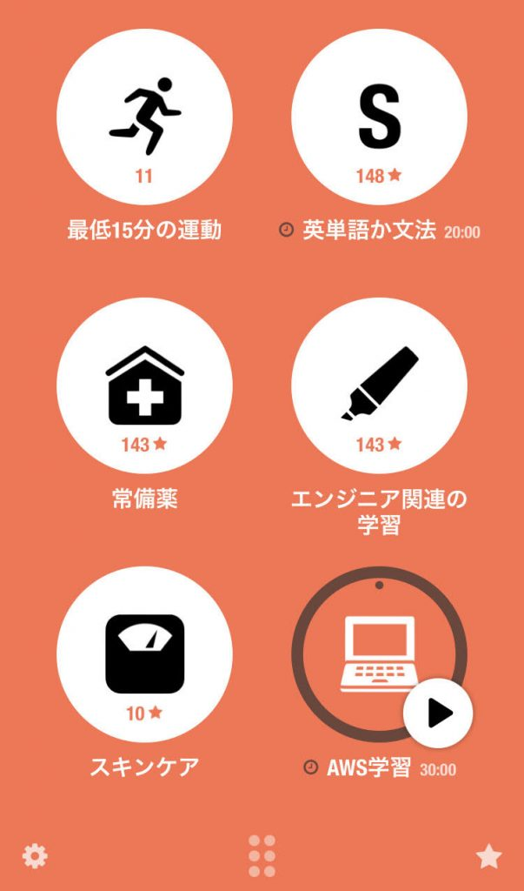

<!--
_class: lead
_paginate: false
_header: ""
-->

# 昔のワイ「時間は作るもの」

---

<!--
_class: lead
_paginate: false
_header: ""
-->

### キリッ

---
<!--
_color: white
-->

# 私は誰？

- 元公務員の2児のパパエンジニア(4歳、1歳)
- DevOpsなエンジニア目指して日々学習
- AWS11冠取得しましたが、実務まだまだなので精進中

---
<!--
_class: lead
_paginate: false
_header: ""
-->

# 「時間は作るもの」
## これは正しい

---

<!--
_class: lead
_paginate: false
_header: ""
-->

# ただ現実問題・・・

---

# 子はとても可愛いが時間は激減した

- 1人目で激減っぷりに困惑
- 2人目はもっと無理だった
- 妻はもっと時間がない

---
# 2人目の子供が生まれる前は

### 平日

- 退勤電車や夜の時間で勉強
- 始業前にも勉強

### 休日

- 時間を妻と交互にとりあったり
- 子供がテレビを見ている隙に勉強 etc..

---
<!--
_class: lead
_paginate: false
_header: ""
-->
# でも赤ちゃんがいると無理

---

- 夜は寝かしつけですぐ寝るとは限らない
  - 下の子が寝ている上の子を起こしたり、その逆も然り
  - 自分が残業する日も当然ある
- 昼は目が離せない
  - 動くにようになったら本当に1秒も目が離せない
  - 相互にママを取り合う子供たち

蓄積される両親の疲労とストレス

---

# 悟る
## 夜は無理

- 無理じゃないけど、ギャンブル性が高い
- 夜に勉強できないと、焦りとストレスで胃がマッハ

---
<!--
_class: lead
_paginate: false
_header: ""
-->

# 仕方ねぇ。朝活するか
# 今まで朝起きれた試しないけど！

---
# 朝活始めてみたところ

## やってみたら意外とできた

- ここで起きないと１日勉強できないかもという使命感
- 毎日起きてるとわりと自然に起きれるようになってきた

---

# やってみてわかった大事なもの

- 「最悪5分でも朝勉強したら勝ち」くらいの気持ち
- 周囲を起こさないようにスマートウォッチの目覚まし
- 習慣化したいことを2~3個書き出して毎日5分でもやること

AppleWatchと習慣化アプリに感謝する毎日

---
# Streaksというアプリの存在

- 主にAppleWatchで使用
- 習慣化したい行動をあげておく
- 連続記録を落としたくない衝動

---
# 朝活効果

- 「夜に勉強できるかわからない」というストレスの消滅
- AWS認定11種合格できた
- 早起きで体調が良い気がする
- 何よりストレスが減り、朝子供を優しい気持ちで起こせる

---
# 朝苦手な人は

- 体質にもよるので無理に朝活をしなくてもよい
- ただ「絶対に確保できる時間」を見つけて、5分でも良いから毎日やる

*習慣化するとやらないと気持ちがわるくなってくる*

---
# 小さい子供を育てているエンジニアの方達へ

- 子育てとエンジニアとしての成長を両立したい気持ちがわかりすぎます
- 今が一番時間がないと割り切りましょう
- この時間の使い方に慣れれば、5年後すごく楽になる・・・はず
